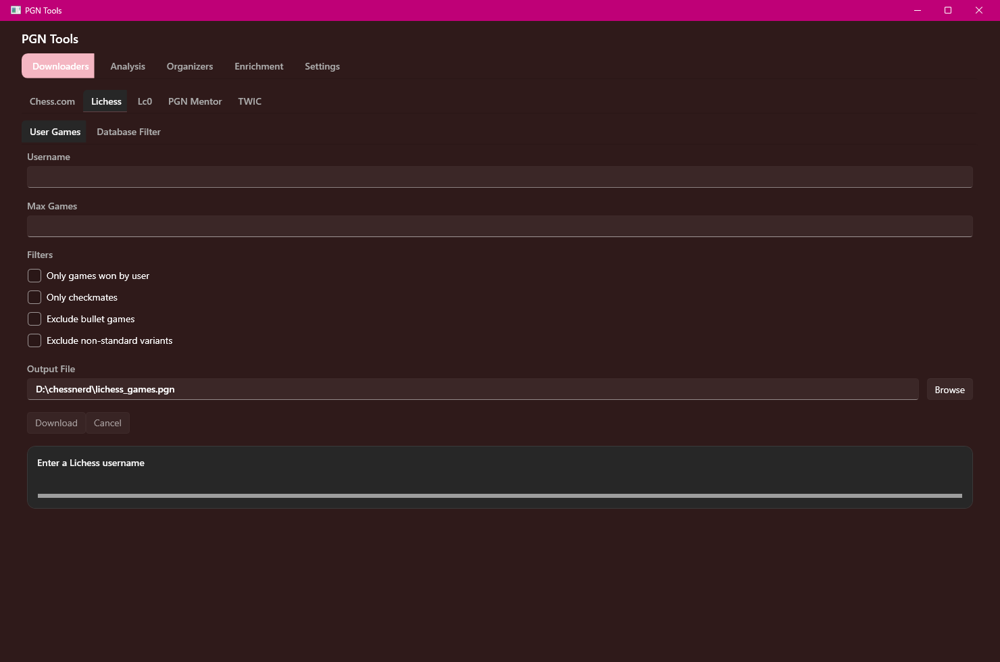

# PGN Tools

A fast, dark-mode **Windows desktop app for working with PGN chess files** — download games, clean and organize them, enrich the tags, and run engine analysis. It streams games one at a time, so it handles multi-gigabyte PGN files without choking, all from a single app.

_Built with heavy AI assistance — the owner provided the direction, requirements, and testing._



## Features

**Download** games from where you actually get them:
- **Chess.com** — a player's full archive, or a monthly crawl by rating band
- **Lichess** — a player's games, or a filtered monthly database export
- **Lc0** training games, **PGN Mentor**, and **TWIC**

The Chess.com and Lichess player downloads share the same filters: only games you won, only checkmates, exclude bullet, exclude non-standard variants.

**Organize** large collections:
- **Filter** (Elo, ply count, checkmates, annotation cleanup), **Sort**, **Split**, **Merge**, **Deduplicate**, and **Tour Breaker** (pull real tournaments out of a giant dump).

**Enrich** the headers:
- **ECO** opening tags, missing **Elo** fill-in, **event category**, **ply counts**, **Stockfish** version normalization, and annotation **stripping**.

**Analyze**:
- **PGN statistics** overview, **UCI/Stockfish** engine analysis, **Elegance** scoring, and a **checkmate-only** filter.

## Install

1. Open the [**Releases**](../../releases) page.
2. Download the latest `PgnTools-…-win-x64.exe`.
3. Double-click it.

It's a single self-contained file — no installer, and no .NET runtime to install separately.

## Build from source

Requires the **.NET 10 SDK** on Windows. To build the single-file executable:

```powershell
.\build.cmd
```

That produces `Build\PgnTools.Wpf.Release\PgnTools.exe`. Or, while developing, just run it:

```powershell
dotnet run --project PgnTools.Wpf/PgnTools.Wpf.csproj
```

## Tech

.NET 10 · WPF (Fluent dark theme) · CommunityToolkit.Mvvm · Microsoft.Extensions.DependencyInjection. The heart of the app is a streaming, low-allocation PGN reader/writer shared across every tool.

## Project layout

- `PgnTools.Wpf/` — the app
- `PgnTools/` — the shared PGN engine, services, and view-models the app is built on
- `Docs/` — per-tool notes and design docs
- `build.cmd` — one-step local build

## Support

PGN Tools is free. If it saved you time — or it's the kind of thing you'd have happily paid for — you can drop a few bucks in the tip jar. It's genuinely appreciated and helps keep the project going.

[](https://ko-fi.com/ianrastall)

## License

See [LICENSE](LICENSE).

---

### Releasing (for maintainers)

Releases are made with a button — nothing to remember:

1. Go to the repo's **Actions** tab → the **Release** workflow → **Run workflow**.
2. Type a version (e.g. `v1.0.0`) and click the green **Run workflow** button.
3. It builds the single-file exe and publishes a GitHub Release with it attached.

Regular commits and pushes never create a release — only that button does, so commit as often as you like.
