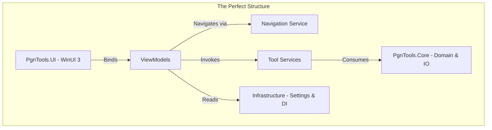

Based on the provided codebase and the constraints defined in `Agents.md` (Zero-allocation, C# 14, WinUI 3), here is the architectural design for the "perfect" PgnTools application.

### 1. High-Level Architecture

The application should follow a strict **Layered Hexagonal Architecture** to separate the UI from the high-performance domain logic.



#### A. Core Layer (`PgnTools.Core`)
This is the engine room. It contains no UI dependencies. It handles the raw bits and bytes.
*   **Parsing:** A streaming parser using `System.IO.Pipelines`. It should yield `Game` objects or `Span<GameHeader>` without loading the whole file into RAM.
*   **Chess Logic:** Fast board representation (likely 0x88 or Bitboards) for move validation and analysis.
*   **Interfaces:** Defines contracts like `IPgnReader`, `IPgnWriter`, `IEngineClient`.

#### B. Service Layer (`PgnTools.Services`)
This contains the business logic for specific tools (Deduplicator, Splitter, etc.).
*   **The `ITool` Interface:** All tools should implement a standard interface.
    ```csharp
    public interface ITool
    {
        string Name { get; }
        string IconGlyph { get; }
        Type ViewModelType { get; }
    }
    ```
*   **Execution Model:** Every tool service method should accept an `IProgress<double>` for reporting status and a `CancellationToken` for stopping the operation.

#### C. Presentation Layer (`PgnTools.UI`)
*   **MVVM:** Strict separation using `CommunityToolkit.Mvvm`.
*   **Shell:** A main `MainWindow` hosting a `NavigationView` (sidebar) and a `Frame` (content area).
*   **Theming:** Dynamic resource switching using `AppBrushes.xaml`.

---

### 2. The Ideal Workflow

To make the program feel seamless, we move away from "Open file -> Select Tool -> Run" and towards a **Context-Aware Workflow**.

#### Step 1: The Session (Context)
When a user opens a PGN file, the app creates a **Session Context**.
*   **Data:** `FilePath`, `Encoding`, `GameCount` (from a quick index scan).
*   **State:** The `SessionService` holds this state.
*   **Benefit:** When the user navigates to the "Deduplicate" tool, they don't need to select the file again; the tool pre-fills with the *Current Session* file.

#### Step 2: Navigation & Dependency Injection
1.  User clicks "Deduplicate" in Sidebar.
2.  `INavigationService` requests `RemoveDoublesViewModel` from the DI container.
3.  **Constructor Injection:** The VM is created with its required dependencies:
    ```csharp
    public partial class RemoveDoublesViewModel(
        IRemoveDoublesService service, 
        ISessionService session, 
        IDialogService dialog) : ObservableObject
    { ... }
    ```
4.  The VM automatically pulls the current file path from `ISessionService` to populate the UI "Source" field.

#### Step 3: Asynchronous Execution
1.  User clicks "Start".
2.  Command creates a `CancellationTokenSource`.
3.  Command executes `await Task.Run(() => service.ProcessAsync(...))`.
4.  **Zero-UI Freeze:** The heavy lifting happens on a background thread.
5.  **Progress:** The service reports back progress (0% to 100%) via `IProgress<T>`. The UI updates a ProgressBar.

#### Step 4: Result Handling
1.  Upon completion, the service returns a `ToolResult` (Success, Path to output file, Error message).
2.  The VM triggers an `InfoBar` (Success/Error).
3.  The `SessionService` updates the "Current File" to the *newly generated file*.
4.  The user can immediately click "Filter" next, and it will apply to the deduplicated file without browsing again.

---

### 3. Interoperability & Performance Patterns

How do the specific tools mentioned in your codebase (Stockfish, ECO, Lichess) interact perfectly?

#### A. The "Tool Pipeline" Pattern
Instead of treating tools as isolated silos, design the output to chain into the input.
*   **Example:**
    1.  **Download Tool:** Downloads `games.pgn` from Lichess.
    2.  **User Action:** Automatically triggers "Open" on the downloaded file.
    3.  **Filter Tool:** User filters for "Blitz" games -> `blitz_games.pgn`.
    4.  **Analyze Tool:** User runs Stockfish on `blitz_games.pgn`.

#### B. The Reader/Writer Strategy (Streaming)
This is critical for the "Zero-allocation" requirement.
*   **The Problem:** If `RemoveDoubles` reads the whole file into a `List<string>`, a 2GB file crashes the app.
*   **The Solution:**
    *   `PgnReader` implements `IEnumerable<Game>` (yield return).
    *   `PgnWriter` accepts `IAsyncEnumerable<Game>`.
    *   `RemoveDoubles` acts as a LINQ operator:
        ```csharp
        await writer.WriteAsync(
            reader.ReadAsync(path)
                .DistinctBy(g => g.UniqueSignature) // Streaming filter
        );
        ```

#### C. Engine Integration (Stockfish/Lc0)
*   **Abstraction:** Create a generic `IEngineController`.
*   **Lifecycle:** The engine (EXE) runs as a background `Process`.
*   **Protocol:** Implement UCI (Universal Chess Interface) protocol handler.
*   **Interoperability:** The `ChessAnalyzerService` sends FEN strings (Forsyth–Edwards Notation) to the engine, gets evaluations, and injects them as annotation comments (e.g., `{+1.23}`) into the PGN stream *before* it hits the disk.

#### D. Caching (ECO & Ratings)
*   **Problem:** Looking up ECO codes or Ratings from a text file for every game is slow (I/O bottleneck).
*   **Solution:** On startup (App.xaml.cs), load `eco.pgn` and rating lists into a **Memory-Mapped File** or a highly optimized `Dictionary`/`HashSet` in memory.
*   **Usage:** `EcoTaggerService` looks up moves in O(1) time against the in-memory tree.

### 4. Refined Project Structure

Based on `Agents.md`, here is how the folders should be organized to enforce this architecture:

*   **`PgnTools.Core`**
    *   `Parsers/` (State machines for PGN parsing)
    *   `Models/` (Game, Move, Board)
    *   `Interfaces/` (IPgnReader, IWriter)
*   **`PgnTools.Services`**
    *   `Analysis/` (Stockfish integration)
    *   `Processors/` (Splitter, Joiner, Deduplicator)
    *   `Network/` (Downloaders for Lichess, TWIC)
    *   `Metadata/` (Eco, Ratings, Plycount)
*   **`PgnTools.UI`**
    *   `Views/` (XAML files)
    *   `ViewModels/` (The glue)
    *   `Converters/` (UI logic)
    *   `Controls/` (Custom reusable chess controls)
*   **`PgnTools` (App Entry)**
    *   `Services/` (DI Registration, Navigation, Settings)

### 5. Specific Implementation Recommendation: The `ToolRegistry`

Your `App.xaml.cs` references `ToolRegistry.Tools`. This should be the central hub for the UI.

```csharp
public static class ToolRegistry
{
    public static IEnumerable<ToolDescriptor> Tools => new[]
    {
        new ToolDescriptor("Split", Symbol.Split, typeof(PgnSplitterViewModel)),
        new ToolDescriptor("Merge", Symbol.Merge, typeof(PgnJoinerViewModel)),
        new ToolDescriptor("Deduplicate", Symbol.Calculate, typeof(RemoveDoublesViewModel)),
        // ... add all other tools here
    };
}
```

The `ShellViewModel` binds to this collection. This makes the UI **plug-and-play**. When you add a new feature (e.g., "Tournament Breaker"), you simply add the View, ViewModel, Service, and register it here. The sidebar updates automatically without touching XAML.

### Summary
The "perfect" version of this program is a **Stream-Processing Pipeline** wrapped in a **Modern Modular UI**.
1.  **Don't load files whole; stream them.**
2.  **Don't hardcode navigation; use a registry.**
3.  **Don't block the UI; use `Task.Run` and `IProgress`.**
4.  **Keep the Context:** Pass the file from tool to tool so the user focuses on *workflow*, not *file management*.